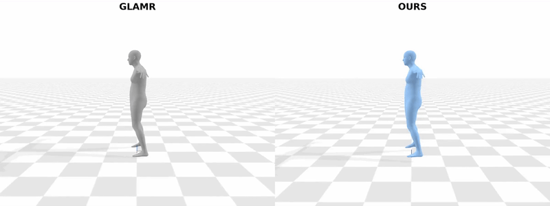

# Improving Human Motion Plausibility with Body Momentum [BMVC 2025]
[Ha Linh Nguyen](https://www.comp.nus.edu.sg/~hlinhn/), [Tze Ho Elden Tse](https://eldentse.github.io/), [Angela Yao](https://www.comp.nus.edu.sg/~ayao/) 

[[Project page]](https://hlinhn.github.io/momentum_bmvc/) [[Paper]](https://arxiv.org/abs/2509.09496)

<!-- > Code repository for the paper:  
> [**Improving Human Motion Plausibility with Body Momentum**](https://arxiv.org/abs/2509.09496) -->

<p align="center">

</p>

Many studies decompose human motion into local motion in a frame attached to the root joint and global motion of the root joint in the world frame, treating them separately. However, these two components are not independent. Global movement arises from interactions with the environment, which are, in turn, driven by changes in the body configuration. Motion models often fail to precisely capture this physical coupling between local and global dynamics, while deriving global trajectories from joint torques and external forces is computationally expensive and complex. To address these challenges, we propose using whole-body linear and angular momentum as a constraint to link local motion with global movement. Since momentum reflects the aggregate effect of joint-level dynamics on the body’s movement through space, it provides a physically grounded way to relate local joint behavior to global displacement. Building on this insight, we introduce a new loss term that enforces consistency between the generated momentum profiles and those observed in ground-truth data. Incorporating our loss reduces foot sliding and jitter, improves balance, and preserves the accuracy of the recovered motion.


## Instructions
```
conda env create -f environment.yml
```

Check out instructions in each subfolder.

## TODO
- [x] Release code for momentum calculation
- [x] Release code for GLAMR training and evaluation
- [ ] Release code for WHAM training and evaluation

## Citation
If you find this code useful for your research please consider citing the following paper:

```bibtex
@inproceedings{nguyen2025_body_momentum_bmvc,
  title={Improving Human Motion Plausibility with Body Momentum},
  author={Ha Linh Nguyen and Tze Ho Elden Tse and Angela Yao},
  booktitle = {36th British Machine Vision Conference 2025, {BMVC} 2025, Sheffield, UK, November 24-27, 2025},
  publisher = {BMVA},
  year      = {2025},
}
```

## Acknowledgments
This repository is built upon [GLAMR](https://github.com/NVlabs/GLAMR).